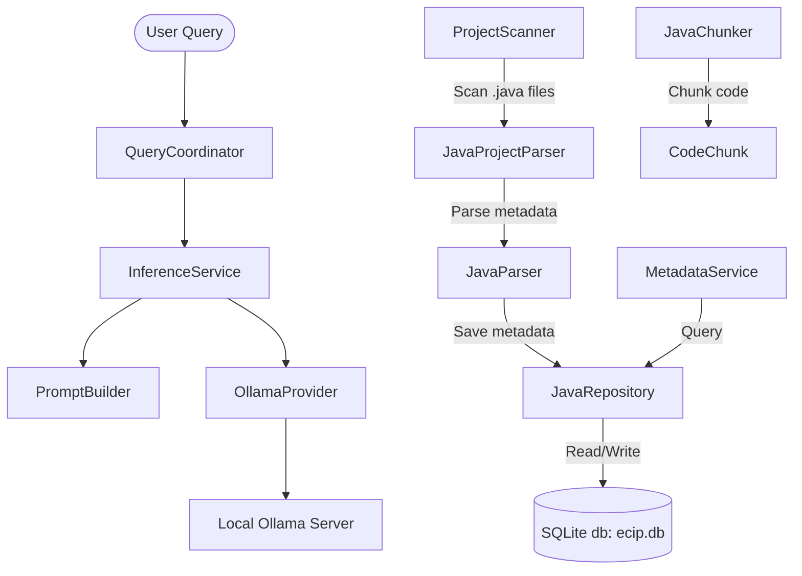

# ECIP-Lite: Project Implementation Summary

This document summarizes the current status, components, and structure of the **ECIP-Lite (Enterprise Code Intelligence Platform Lite)** project.

---

## 🏗️ Architecture & Component Flow

The platform is designed around a modular pipeline starting from project parsing and storage, up to orchestrating local inference using Ollama.



---

## 📂 Directory & File Breakdown

Below is the list of active files, mapped to their design responsibilities and current implementation details:

### 1. Central Inference & Configuration
*   **[settings.py](file:///Users/samirzade/Codes/ecip-lite/ecip_core/inference/config/settings.py)**: Central configuration manager utilizing `pydantic-settings` to load settings from environment variables/`.env` file. Includes configuration for Ollama URL, default model `qwen3.5:9b`, temperature, top_p, etc.
*   **[ollama_provider.py](file:///Users/samirzade/Codes/ecip-lite/ecip_core/inference/providers/ollama_provider.py)**: Low-level provider handling raw communication with the local Ollama API. Agnostic of prompt formatting, database, or project scanner rules.
*   **[prompt_builder.py](file:///Users/samirzade/Codes/ecip-lite/ecip_core/prompt/prompt_builder.py)**: Formats incoming queries with default system prompts and instruction structures.
*   **[inference_service.py](file:///Users/samirzade/Codes/ecip-lite/ecip_core/inference/inference_service.py)**: Main inference orchestrator coordinating input query validation, prompt building via [PromptBuilder](file:///Users/samirzade/Codes/ecip-lite/ecip_core/prompt/prompt_builder.py#L6-L22), raw LLM execution via [OllamaProvider](file:///Users/samirzade/Codes/ecip-lite/ecip_core/inference/providers/ollama_provider.py#L15-L35), and returning structured responses.
*   **[query_coordinator.py](file:///Users/samirzade/Codes/ecip-lite/ecip_core/coordinator/query_coordinator.py)**: Main entry point/workflow coordinator meant to link parsers, database retrieval layers, and inference. Currently acts as a wrapper around the inference service.
*   **[request.py](file:///Users/samirzade/Codes/ecip-lite/ecip_core/models/request.py)** & **[response.py](file:///Users/samirzade/Codes/ecip-lite/ecip_core/models/response.py)**: Contain Pydantic validation models `InferenceRequest` and `InferenceResponse`.

### 2. Code Parsing & Scanning
*   **[project_scanner.py](file:///Users/samirzade/Codes/ecip-lite/ecip_core/scanner/project_scanner.py)**: Recursively crawls project directories and filters all files ending with `.java`.
*   **[java_parser.py](file:///Users/samirzade/Codes/ecip-lite/ecip_core/parser/java/java_parser.py)**: Performs parsing on a single Java source file. Extracts structure metadata including package names, imports, class name, and method names via regex/string matching.
*   **[parsed_java_file.py](file:///Users/samirzade/Codes/ecip-lite/ecip_core/parser/models/parsed_java_file.py)**: Pydantic model representation of a parsed Java file.
*   **[project_parser.py](file:///Users/samirzade/Codes/ecip-lite/ecip_core/parser/java/project_parser.py)**: Coordinates [ProjectScanner](file:///Users/samirzade/Codes/ecip-lite/ecip_core/scanner/project_scanner.py#L4-L13) and [JavaParser](file:///Users/samirzade/Codes/ecip-lite/ecip_core/parser/java/java_parser.py#L9-L83) to process entire directories of Java files.

### 3. Knowledge Base & Storage
*   **[database.py](file:///Users/samirzade/Codes/ecip-lite/ecip_core/storage/sqlite/database.py)**: Bootstraps local SQLite connection to `data/ecip.db`.
*   **[schema.py](file:///Users/samirzade/Codes/ecip-lite/ecip_core/storage/sqlite/schema.py)**: Defines schema migrations and table creation structures. It creates:
    *   `java_files`: Stores file names, system paths, class names.
    *   `java_methods`: Stores individual method signatures mapped to their respective file entries via foreign keys.
*   **[repository.py](file:///Users/samirzade/Codes/ecip-lite/ecip_core/storage/sqlite/repository.py)**: Implements database operations `save`, `get_all_files`, `find_by_class_name`, `find_methods`, and `find_file_by_method`.
*   **[metadata_service.py](file:///Users/samirzade/Codes/ecip-lite/ecip_core/retrieval/metadata/metadata_service.py)**: High-level retrieval service layer wrapper over the `JavaRepository` repository.

### 4. Chunking & Code Processing
*   **[code_chunk.py](file:///Users/samirzade/Codes/ecip-lite/ecip_core/chunking/code_chunk.py)**: Holds standard data representations of code chunks.
*   **[java_chunker.py](file:///Users/samirzade/Codes/ecip-lite/ecip_core/chunking/java_chunker.py)**: Defines logic to segment Java source files. Currently implemented as a placeholder returning the entire file contents.

### 5. Testing & Samples
*   **[UserController.java](file:///Users/samirzade/Codes/ecip-lite/projects/sampleProject/UserController.java)**, **[UserRepository.java](file:///Users/samirzade/Codes/ecip-lite/projects/sampleProject/UserRepository.java)**, & **[UserService.java](file:///Users/samirzade/Codes/ecip-lite/projects/sampleProject/UserService.java)**: Sample Java files mimicking standard Spring Boot layered architecture patterns for verifying scanner/parser efficiency.

---

## 🛠️ Code Issues & Improvements Identified

During the analysis, the following areas were noted for improvement or correction:

> [!WARNING]
> **Database Insertion SQL Bug in [repository.py](file:///Users/samirzade/Codes/ecip-lite/ecip_core/storage/sqlite/repository.py#L22-L40):**
> In the `save` method of `JavaRepository`, the query contains a mismatch in the columns, placeholders, and value tuple parameter lengths.
> *   **Query columns (3):** `file_name`, `file_path`, `class_name`
> *   **Placeholders (4):** `(?, ?, ?, ?)`
> *   **Values tuple (5):** `(file_name, file_path, source_code, package_name, class_name)`
> 
> *Fix needed:* Add missing columns (`source_code` and `package_name` if needed in the schema) or adjust the placeholders and values to match the schema columns.

> [!NOTE]
> **Duplicate File Parsing in [project_parser.py](file:///Users/samirzade/Codes/ecip-lite/ecip_core/parser/java/project_parser.py#L24-L34):**
> Within the loop of `parse_project`, the file is parsed and appended twice:
> ```python
> for java_file in java_files:
>     parsed = self.parser.parse(str(java_file))
>     parsed_files.append(parsed)
>     parsed = self.parser.parse(str(java_file))
>     parsed_files.append(parsed)
> ```

---

## 🚀 Execution & Next Milestones

1.  **Resolve parsing duplication & SQL bugs** to enable stable database insertions.
2.  **Enhance Chunking Pipeline:** Implement context-aware Java chunking logic in [JavaChunker](file:///Users/samirzade/Codes/ecip-lite/ecip_core/chunking/java_chunker.py) to partition code based on class structure or methods rather than wrapping entire files.
3.  **Integration of retrieval context:** Wire the database/metadata repository search results into the prompt-building process within `QueryCoordinator` to supply local context before executing inference requests.
