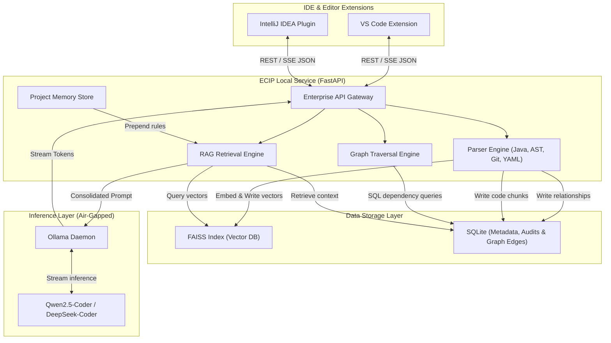
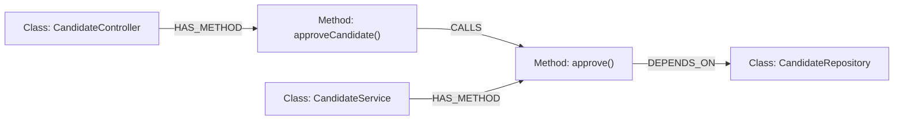
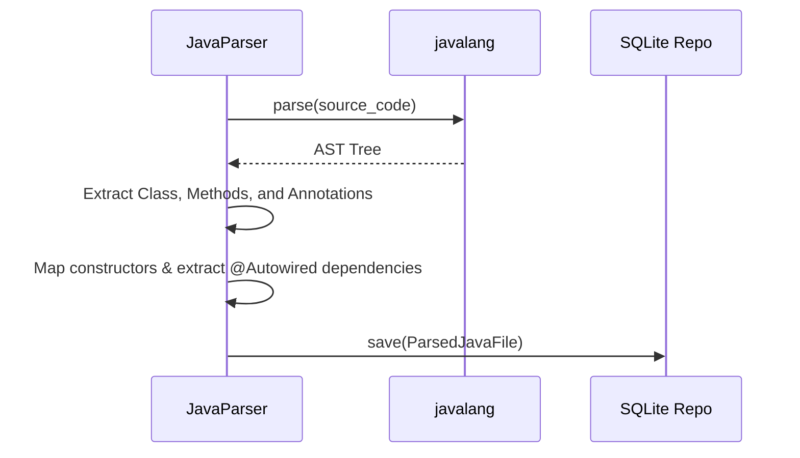
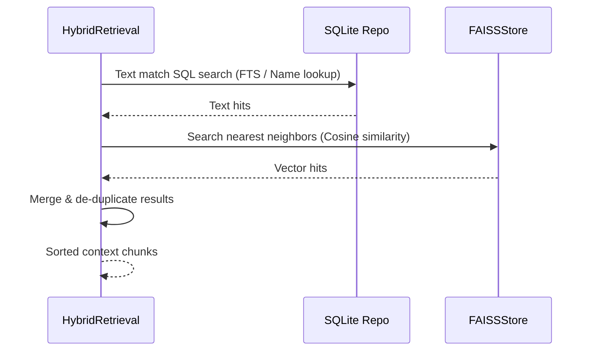

# Enterprise Code Intelligence Platform (ECIP-Lite) Master Project Documentation

This document serves as the single source of truth for the Enterprise Code Intelligence Platform (ECIP-Lite). It aggregates the Business Requirements (BRD), High-Level Design (HLD), Technical Requirements (TRD), Low-Level Design (LLD), and a complete inventory of all files in the codebase.

---

## 1. Business Requirements Document (BRD)

### 1.1 Context & Market Gap
Modern software engineering organizations are rapidly adopting AI-driven coding assistants. However, enterprise sectors with strict security, intellectual property (IP), and data protection regulations (e.g., banking, healthcare, government, defense) are legally and structurally barred from using public cloud-based AI tools like GitHub Copilot or Amazon Q. pasteing proprietary code segments into public LLMs violates regulatory compliance (HIPAA, SOC2, GDPR).

ECIP addresses this market gap by delivering a **fully offline, privacy-first, on-premise AI platform** that runs locally on developer workstations or isolated corporate networks, while possessing deep semantic and structural awareness of proprietary codebases.

### 1.2 Core Value Proposition
- **100% Data Privacy:** Zero outbound internet calls. All indexing, code analysis, and inference are contained within the client’s air-gapped machine or firewall.
- **Structural Integrity:** Unlike generic LLMs that guess code relations, ECIP indexes classes, methods, and relationships into a localized SQLite representation of a dependency graph, enabling exact impact assessments.
- **Architecture Memory:** Developers can enforce corporate coding standards (e.g., Spring Boot 3 conventions, JUnit 5 test setups) dynamically via a project-wide configuration memory injected directly into inference prompts.

### 1.3 Target Personas
1. **The Enterprise Developer:** Needs fast, offline, context-aware answers, code completions, and test generations tailored to their current class files without leaving the IDE.
2. **The Tech Lead / Architect:** Needs to onboard team members quickly and ensure code matches design patterns (e.g., constructor dependency injection instead of field injection).
3. **The Compliance & Security Officer:** Needs to verify that no source code, telemetry, or metadata packet leaves the local host or VPC network boundaries.

### 1.4 Scope Boundaries
- **In-Scope:**
  - Quantized, local LLM execution via Ollama/vLLM.
  - Multi-pillar parser suite specializing in Java (AST parsing with `javalang`), build configuration, and SQL DDL.
  - SQLite-based relational dependency graph indexing.
  - Local semantic vector retrieval utilizing FAISS database.
  - Interactive citations engine linking code answers directly to source files and line ranges.
- **Out-of-Scope:**
  - Multi-tenant cloud SaaS hosting.
  - Integrations with external AI APIs (OpenAI, Anthropic).
  - Out-of-the-box support for non-Java ecosystems (MVP targets Java/Spring Boot and React).

### 1.5 Success Metrics & Key Performance Indicators (KPIs)
- **Code Accuracy:** 85%+ of generated code compiles successfully on the first attempt.
- **Standards Enforcement:** 90%+ of code completions adhere to conventions defined in the Project Memory config.
- **Search Efficiency:** Developers locate dependencies and file boundaries 30% faster.
- **Telemetry Compliance:** 100% local compliance; zero network leak audits.

### 1.6 Pricing Models
- **On-Premise Node License:** Fixed annual subscription fee ranging from ₹10 Lakh to ₹1 Crore depending on client scale and developer count.
- **Private VPC Hosting:** Managed subscription of ₹500 – ₹2,000 per seat/month for deployments in isolated AWS/Azure accounts.
- **Support & Customizations:** Custom service agreements for fine-tuning models on proprietary codebases or adding specific parser modules.

### 1.7 Cost Estimation & Development Timeline
- **GPU rental & training compute:** ₹50,000 – ₹2,00,000 for local/cloud fine-tuning.
- **Timeline (part-time solo dev):** ~12–15 months total:
  - Months 1–4: Local LLM setup, basic RAG, VS Code chat interface (MVP).
  - Months 4–7: Advanced Java & dependency parsing, SQLite index, CLI loop.
  - Months 7–10: Graph analysis, local project memory config injection.
  - Months 10–14: Enterprise APIs, IntelliJ plugin, server-mode deployment.

---

## 2. High-Level Design (HLD)

### 2.1 System Topology Architecture
ECIP runs as a local background daemon (FastAPI server) communicating with local database layers and an air-gapped LLM provider (Ollama), which feeds suggestions directly to VS Code or IntelliJ IDE panels.



### 2.2 Logical Component Breakdown
1. **Developer IDE Layer:** Interactive UI panels rendering sidebar chat, ghost-text completions, and citations. Communication with the Core Daemon occurs via HTTP REST and Server-Sent Events (SSE).
2. **Core Daemon (FastAPI backend):** Orchestrates indexing, coordinates hybrid search, runs entity extraction, parses queries, and serves REST requests.
3. **Storage & DB Layer:**
   - **FAISS:** Local vector file storage (`index.faiss`), optimized for fast nearest-neighbor calculations.
   - **SQLite:** Central metadata index (`ecip.db` and project databases) tracking scanned files, parsed AST details, and class inheritance/dependency edges.
4. **Local Inference Layer:** Manages Q4/Q5 quantized models locally via Ollama endpoints.

### 2.3 Core Architectural Patterns
- **Hexagonal Architecture (Ports & Adapters):** Decouples vector backends and inference servers. Interfaces allow swapping FAISS for Qdrant or Ollama for vLLM easily.
- **Observer Pattern:** File watchers monitor the active workspace. Any file write triggers incremental parsing, chunking, and index updates asynchronously.

### 2.4 Dependency Topology Schema
The SQLite database stores semantic linkages to trace dependencies and evaluate modification impacts.



---

## 3. Technical Requirements Document (TRD)

### 3.1 Technology Stack & Component Selection
- **Inference Orchestrator:** Ollama (laptop deployments) and vLLM (server cluster deployments).
- **Backend framework:** FastAPI (Python 3.10+).
- **Vector Search Engine:** FAISS (using `faiss-cpu` for zero external software dependencies on client machines).
- **Relational Metadata / Graph Storage:** SQLite3 (local, cross-platform file database).
- **Java Parser:** `javalang` library for abstract syntax tree (AST) extraction.
- **Embedding Model:** `nomic-embed-text` (768-dimension local embeddings).
- **CLI Framework:** Click (python command-line parser).

### 3.2 Hardware Requirements
- **Workstation Mode (Laptop):** 
  - CPU: AMD Ryzen 5 Pro / Intel Core i7 (6+ Cores) or Apple M1/M2/M3.
  - RAM: 16 GB DDR4/DDR5 unified memory minimum.
  - Storage: NVMe SSD (20 GB free space for weights, cache, and indexes).
- **Server Deployment Mode:**
  - CPU: AMD EPYC / Intel Xeon (16+ Cores).
  - RAM: 64 GB+ RAM.
  - GPU: 1x NVIDIA A10G / L4 (24GB VRAM) or A100 (40GB/80GB VRAM).

### 3.3 Model Sizing & Quantization Constraints
To run within the 16 GB laptop footprint, LLMs must be quantized to **4-bit (Q4_K_M)**:
- **Qwen2.5-Coder-7B-Instruct (Q4_K_M):** File Size: ~4.7 GB, VRAM usage: ~5.8 GB. (Recommended sweet spot, runs at 25-35 tokens/sec).
- **DeepSeek-Coder-V2-Lite-16B (Q4_K_M):** File Size: ~9.5 GB, VRAM usage: ~11.2 GB. (Borderline speed limits: 10-15 tokens/sec).

### 3.4 Air-Gapped Network Configuration & Security Posture
- **Strict Isolation:** The platform binds exclusively to localhost interfaces (`127.0.0.1`) by default. There are no external DNS calls.
- **Audit Trails:** Operations log developer actions, file hashes, and response latencies locally in an audit SQLite file (`~/ecip-data/audit.db`). No code details are collected outside the system.

### 3.5 System Data Schema
The local workspace SQLite database uses the following schemas:

```sql
CREATE TABLE java_files (
    id INTEGER PRIMARY KEY AUTOINCREMENT,
    file_name TEXT,
    file_path TEXT UNIQUE,
    package_name TEXT,
    class_name TEXT,
    file_hash TEXT
);

CREATE TABLE java_methods (
    id INTEGER PRIMARY KEY AUTOINCREMENT,
    file_id INTEGER,
    method_name TEXT,
    FOREIGN KEY(file_id) REFERENCES java_files(id) ON DELETE CASCADE
);

CREATE TABLE projects (
    project_id TEXT PRIMARY KEY,
    alias TEXT,
    root_path TEXT UNIQUE,
    indexed_at TEXT,
    indexed_files INTEGER,
    total_chunks INTEGER,
    total_vectors INTEGER,
    status TEXT
);

CREATE TABLE dependency_edges (
    id INTEGER PRIMARY KEY AUTOINCREMENT,
    project_id TEXT,
    source_class TEXT,
    target_class TEXT,
    relationship_type TEXT,
    discovered_at TEXT,
    UNIQUE(project_id, source_class, target_class, relationship_type)
);
```

### 3.6 API Interface Definitions
The FastAPI backend exposes the following REST APIs:
- **`POST /api/v1/query`**:
  - Request: `{"question": "How does class UserService work?"}`
  - Response: Yields JSON chunks streaming tokens, citations, and metadata.
- **`POST /api/v1/indexing`**:
  - Request: `{"project_path": "/path/to/project"}`
  - Response: Initiates incremental directory scans and updates SQLite/FAISS.
- **`POST /api/v1/projects`**:
  - Request: `{"project_id": "test-project", "root_path": "/path/to/project"}`
  - Response: Registers a new workspace project.

---

## 4. Low-Level Design (LLD)

### 4.1 Codebase Directory Map
```text
ecip_core/
├── api/
│   ├── routes/             # REST endpoints (query, indexing, projects, workspace)
│   ├── models/             # Pydantic HTTP API schemas
│   └── main.py             # FastAPI App definition
├── cache/                  # Cache manager for prompt results & embedding hits
├── chunking/               # Code parsing separators (Overview and Method chunkers)
├── citations/              # Line citations generator matching prompt results to files
├── common/                 # Standard exceptions & log configurations
├── config/                 # Deployment profiles and workspace domain configurations
├── coordinator/            # QueryCoordinator orchestrating pipeline flows
├── dependency/             # Dependency graph builder and impact analysis engines
├── diagnostics/            # Diagnostics checks verifying disk space and daemon state
├── embedding/              # Vector calculations and Ollama embedding wrappers
├── indexing/               # IndexBuilder conducting workspace scans and DB updates
├── inference/              # Local LLM generation adapters & Ollama providers
├── logging/                # Logger formatters and correlation trackers
├── models/                 # Request/Response core structures
├── output/                 # CLI output response formatter
├── parser/                 # Javalang AST parsers extracting classes/methods/dependencies
├── prompt/                 # Prompt builder constructing template queries
├── query/                  # Intent analyzer and Entity extractor modules
├── retrieval/              # Hybrid vector & metadata databases retrieval
├── scanner/                # ProjectScanner recursively mapping file paths
├── storage/                # SQLite initialization and SQL queries repo
├── vectorstore/            # FAISSStore managing vector IO operations
├── workspace/              # Manager tracking active workspace files
├── main.py                 # Interactive console CLI entry point
└── settings.py             # Central application configuration loader
```

### 4.2 AST Java Parser Interface flow
The parsing pipeline reads raw code, uses `javalang` to convert it to an AST, and formats data into a structured output `ParsedJavaFile` object.



### 4.3 Hybrid Search Coordinator Interface flow


### 4.4 Pydantic Validation Schemas
The request models assert type boundaries on inbound fields:
- `InferenceRequest` enforces `question` as non-empty.
- `DependencyRequest` maps `class_name` and traversal depth constraints.
- `ProjectCreate` maps mandatory local directory pathways.

---

## 5. Comprehensive File Index

The following index provides a detail description of every Python source file in the `ecip_core` codebase:

### Core Entry & Settings
- **[ecip_core/main.py](file:///Users/samirzade/Codes/ecip-lite/ecip_core/main.py)**: Command-line interface loop. Captures user prompts, passes them to `QueryCoordinator`, and outputs structured responses via `ResponseFormatter`.
- **[ecip_core/settings.py](file:///Users/samirzade/Codes/ecip-lite/ecip_core/settings.py)**: Configuration shortcut referencing `settings` from `ecip_core/inference/config/settings.py`.
- **[ecip_core/logger.py](file:///Users/samirzade/Codes/ecip-lite/ecip_core/logger.py)**: Logging wrapper for uniform console outputs.

### API Layer (`ecip_core/api/`)
- **[api/main.py](file:///Users/samirzade/Codes/ecip-lite/ecip_core/api/main.py)**: Entry point for the FastAPI server. Patches `sqlite3` for thread safety, configures CORS, and registers API routers with `/api/v1` prefixes.
- **[api/models/index.py](file:///Users/samirzade/Codes/ecip-lite/ecip_core/api/models/index.py)**: Pydantic schemas validating indexing payloads.
- **[api/models/project.py](file:///Users/samirzade/Codes/ecip-lite/ecip_core/api/models/project.py)**: Pydantic schemas validation for project registration requests.
- **[api/models/query.py](file:///Users/samirzade/Codes/ecip-lite/ecip_core/api/models/query.py)**: Inbound search request structures.
- **[api/routes/indexing.py](file:///Users/samirzade/Codes/ecip-lite/ecip_core/api/routes/indexing.py)**: HTTP endpoints for triggering repository scans and indexing.
- **[api/routes/projects.py](file:///Users/samirzade/Codes/ecip-lite/ecip_core/api/routes/projects.py)**: HTTP endpoints for project CRUD operations.
- **[api/routes/query.py](file:///Users/samirzade/Codes/ecip-lite/ecip_core/api/routes/query.py)**: HTTP endpoints for streaming chat answers.
- **[api/routes/workspace.py](file:///Users/samirzade/Codes/ecip-lite/ecip_core/api/routes/workspace.py)**: HTTP endpoints handling diagnostics and workspace status updates.

### Workspace & Project Scanner (`ecip_core/scanner/`, `workspace/`)
- **[scanner/project_scanner.py](file:///Users/samirzade/Codes/ecip-lite/ecip_core/scanner/project_scanner.py)**: Crawls project paths recursively to locate files ending in `.java`, while filtering ignored paths (like `.git` and `target`).
- **[workspace/manager.py](file:///Users/samirzade/Codes/ecip-lite/ecip_core/workspace/manager.py)**: Manages details of the active workspace, resolving configuration targets and database directory structures.

### AST Parser Layer (`ecip_core/parser/`)
- **[parser/java/java_parser.py](file:///Users/samirzade/Codes/ecip-lite/ecip_core/parser/java/java_parser.py)**: Leverages `javalang` to map code syntax structures. Pulls annotations, superclasses, constructors, method line offsets, and field assignments.
- **[parser/java/project_parser.py](file:///Users/samirzade/Codes/ecip-lite/ecip_core/parser/java/project_parser.py)**: Orchestrates recursive file parses across workspaces.
- **[parser/models/parsed_java_file.py](file:///Users/samirzade/Codes/ecip-lite/ecip_core/parser/models/parsed_java_file.py)**: Data model housing imports, dependencies, class attributes, fields, and parsed method tokens.
- **[parser/models/method_info.py](file:///Users/samirzade/Codes/ecip-lite/ecip_core/parser/models/method_info.py)**: Model capturing method signatures, returns, and line positions.
- **[parser/models/field_info.py](file:///Users/samirzade/Codes/ecip-lite/ecip_core/parser/models/field_info.py)**: Model containing field names, types, and annotations.
- **[parser/models/constructor_info.py](file:///Users/samirzade/Codes/ecip-lite/ecip_core/parser/models/constructor_info.py)**: Model matching constructor declarations and constructor parameters.
- **[parser/models/dependency_metadata.py](file:///Users/samirzade/Codes/ecip-lite/ecip_core/parser/models/dependency_metadata.py)**: Schema capturing field and constructor injection bindings.

### Code Chunking (`ecip_core/chunking/`)
- **[chunking/java_chunker.py](file:///Users/samirzade/Codes/ecip-lite/ecip_core/chunking/java_chunker.py)**: Converts parsed code into granular pieces. Automatically generates a high-level `CLASS_OVERVIEW` chunk (containing variables, constructor blueprints, and public method declarations) and individual `METHOD` code chunks.
- **[chunking/code_chunk.py](file:///Users/samirzade/Codes/ecip-lite/ecip_core/chunking/code_chunk.py)**: Defines code structures, file paths, hashes, and line ranges for semantic embedding.

### Embedding Layer (`ecip_core/embedding/`)
- **[embedding/embedding_service.py](file:///Users/samirzade/Codes/ecip-lite/ecip_core/embedding/embedding_service.py)**: Coordinates batches of chunks to calculate embeddings using local providers.
- **[embedding/providers/ollama_embedding_provider.py](file:///Users/samirzade/Codes/ecip-lite/ecip_core/embedding/providers/ollama_embedding_provider.py)**: Integrates with Ollama API endpoint `/api/embeddings` to fetch vector arrays for text.
- **[embedding/exceptions.py](file:///Users/samirzade/Codes/ecip-lite/ecip_core/embedding/exceptions.py)**: Custom exceptions for failures in embedding calls.

### Vector Storage & Search (`ecip_core/vectorstore/`, `retrieval/`)
- **[vectorstore/faiss_store.py](file:///Users/samirzade/Codes/ecip-lite/ecip_core/vectorstore/faiss_store.py)**: Adapts the `faiss-cpu` library to append, search, delete, and serialize local vector indices.
- **[retrieval/semantic_search.py](file:///Users/samirzade/Codes/ecip-lite/ecip_core/retrieval/semantic_search.py)**: Formulates vectors for search questions and searches the FAISS index.
- **[retrieval/metadata/metadata_service.py](file:///Users/samirzade/Codes/ecip-lite/ecip_core/retrieval/metadata/metadata_service.py)**: Performs search lookups against SQLite file indices.
- **[retrieval/hybrid_retrieval.py](file:///Users/samirzade/Codes/ecip-lite/ecip_core/retrieval/hybrid_retrieval.py)**: Merges scores from semantic search and metadata matches to return prioritized hits.
- **[retrieval/context/context_builder.py](file:///Users/samirzade/Codes/ecip-lite/ecip_core/retrieval/context/context_builder.py)**: Collects files, metadata, and matched code blocks into a formatted string to inject into LLM prompts.

### Dependency & Graph Engine (`ecip_core/dependency/`)
- **[dependency/graph_builder.py](file:///Users/samirzade/Codes/ecip-lite/ecip_core/dependency/graph_builder.py)**: Analyzes parsed AST files to write relationship edges (`EXTENDS`, `IMPLEMENTS`, `DEPENDS_ON`) into the SQLite database.
- **[dependency/dependency_service.py](file:///Users/samirzade/Codes/ecip-lite/ecip_core/dependency/dependency_service.py)**: Provides methods to query relational graphs, tracing direct dependencies, direct dependents, and multi-hop recursive dependency trees via BFS.
- **[dependency/impact_analysis.py](file:///Users/samirzade/Codes/ecip-lite/ecip_core/dependency/impact_analysis.py)**: Traces downstream changes iteratively, producing impact list maps for classes.

### Cache & Storage (`ecip_core/cache/`, `storage/`)
- **[cache/manager.py](file:///Users/samirzade/Codes/ecip-lite/ecip_core/cache/manager.py)**: Stores prompt tokens, matching results, and responses to minimize query times.
- **[storage/sqlite/database.py](file:///Users/samirzade/Codes/ecip-lite/ecip_core/storage/sqlite/database.py)**: Handles connections to SQLite. Initializes tables (`java_files`, `java_methods`, `projects`, `dependency_edges`) and handles database migrations.
- **[storage/sqlite/repository.py](file:///Users/samirzade/Codes/ecip-lite/ecip_core/storage/sqlite/repository.py)**: Houses SQLite queries. Handles save/delete metadata operations and fetches graph connections.

### System Configuration & Logging (`ecip_core/config/`, `logging/`, `common/`)
- **[config/loader.py](file:///Users/samirzade/Codes/ecip-lite/ecip_core/config/loader.py)**: Custom loader parsing profiles.
- **[config/domains.py](file:///Users/samirzade/Codes/ecip-lite/ecip_core/config/domains.py)**: Validates domains.
- **[config/profiles.py](file:///Users/samirzade/Codes/ecip-lite/ecip_core/config/profiles.py)**: Active run settings.
- **[logging/correlation.py](file:///Users/samirzade/Codes/ecip-lite/ecip_core/logging/correlation.py)**: Context correlation utilities to trace queries.
- **[logging/factory.py](file:///Users/samirzade/Codes/ecip-lite/ecip_core/logging/factory.py)**: Logging generator configuration.
- **[logging/formatter.py](file:///Users/samirzade/Codes/ecip-lite/ecip_core/logging/formatter.py)**: Log layout definitions.
- **[logging/timing.py](file:///Users/samirzade/Codes/ecip-lite/ecip_core/logging/timing.py)**: Monitors elapsed time in components.
- **[common/exceptions.py](file:///Users/samirzade/Codes/ecip-lite/ecip_core/common/exceptions.py)**: System exceptions declarations.
- **[common/logger.py](file:///Users/samirzade/Codes/ecip-lite/ecip_core/common/logger.py)**: Common logger utilities.

### Core Coordinator & Query Processing (`ecip_core/coordinator/`, `query/`, `prompt/`, `inference/`, `citations/`, `output/`)
- **[coordinator/query_coordinator.py](file:///Users/samirzade/Codes/ecip-lite/ecip_core/coordinator/query_coordinator.py)**: The brain of the query flow. Performs query parsing, triggers intent and entity matching, delegates to either Graph or Retrieval pipelines, calls LLM, and formats citations.
- **[query/intent_analyzer.py](file:///Users/samirzade/Codes/ecip-lite/ecip_core/query/intent_analyzer.py)**: Resolves whether a query relates to dependency trees, impact analysis, or general code explanation.
- **[query/entity_extractor.py](file:///Users/samirzade/Codes/ecip-lite/ecip_core/query/entity_extractor.py)**: Identifies entity names (e.g. classes, fields) inside questions.
- **[prompt/prompt_builder.py](file:///Users/samirzade/Codes/ecip-lite/ecip_core/prompt/prompt_builder.py)**: Assembles final prompt contexts, combining system rules, retrieved code blocks, and user queries.
- **[inference/inference_service.py](file:///Users/samirzade/Codes/ecip-lite/ecip_core/inference/inference_service.py)**: Manages local model generation calls.
- **[inference/providers/ollama_provider.py](file:///Users/samirzade/Codes/ecip-lite/ecip_core/inference/providers/ollama_provider.py)**: Wraps Ollama chat APIs (`/api/chat`).
- **[citations/citation_engine.py](file:///Users/samirzade/Codes/ecip-lite/ecip_core/citations/citation_engine.py)**: Correlates answers back to local source files and active line ranges.
- **[output/response_formatter.py](file:///Users/samirzade/Codes/ecip-lite/ecip_core/output/response_formatter.py)**: Formats generation speeds, citations, and models for terminal displays.

### Workspace Diagnostics & Metrics (`ecip_core/diagnostics/`, `metrics/`)
- **[diagnostics/service.py](file:///Users/samirzade/Codes/ecip-lite/ecip_core/diagnostics/service.py)**: Runs health checks (e.g. disk space limits, database files, and Ollama connection states).
- **[metrics/collector.py](file:///Users/samirzade/Codes/ecip-lite/ecip_core/metrics/collector.py)**: Measures task times, tracking performance latency.

### Tests Layer (`ecip_core/tests/`)
- **[tests/test_parser.py](file:///Users/samirzade/Codes/ecip-lite/ecip_core/tests/test_parser.py)**: Verifies AST parses on sample Java components.
- **[tests/test_chunker.py](file:///Users/samirzade/Codes/ecip-lite/ecip_core/tests/test_chunker.py)**: Tests overview and method chunks segmentations.
- **[tests/test_faiss.py](file:///Users/samirzade/Codes/ecip-lite/ecip_core/tests/test_faiss.py)**: Verifies adding and searching vectors.
- **[tests/test_semantic_search.py](file:///Users/samirzade/Codes/ecip-lite/ecip_core/tests/test_semantic_search.py)**: Tests vector retrievals.
- **[tests/test_query_coordinator.py](file:///Users/samirzade/Codes/ecip-lite/ecip_core/tests/test_query_coordinator.py)**: End-to-end orchestration tests.
